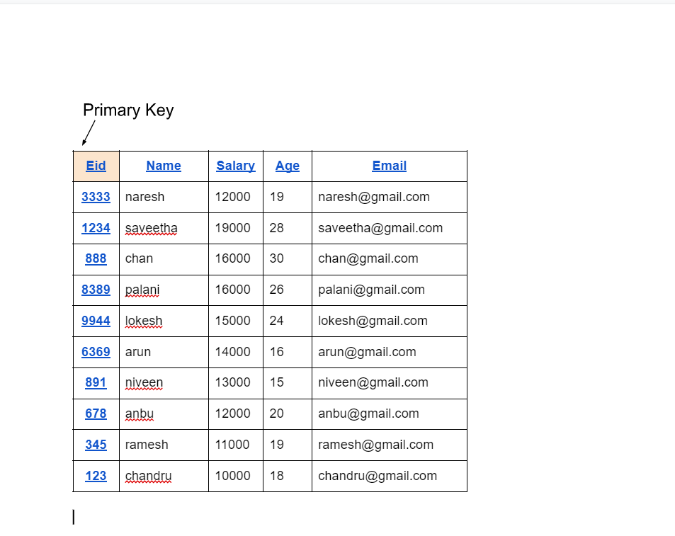
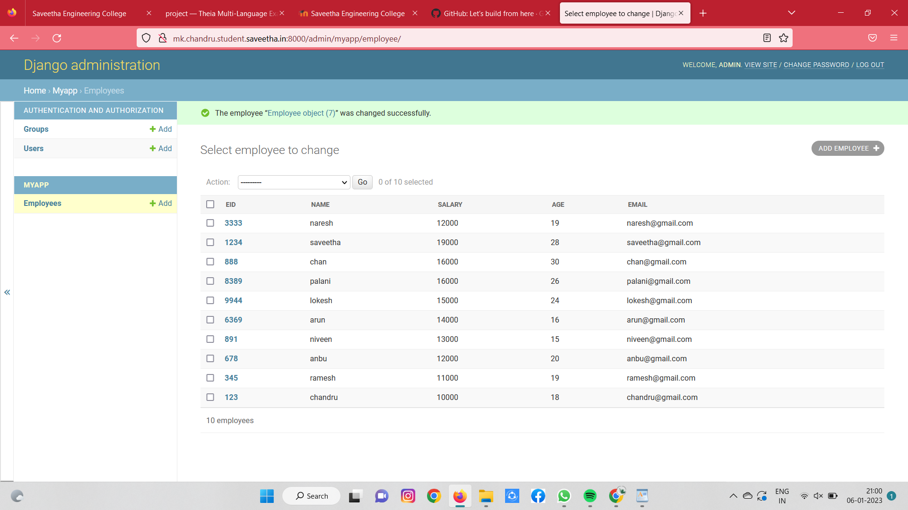

# Django ORM Web Application

## AIM
To develop a Django application to store and retrieve data from a database using Object Relational Mapping(ORM).

## Entity Relationship Diagram


## DESIGN STEPS

### STEP 1:
Create a new app

### STEP 2:
Click on settings.py and insert “import os”. Then insert ‘myapp’ in the configuration INSTALLED_APPS

### STEP 3:
Apply all the migrations to the myapp

## PROGRAM
```
admin.py
from django.contrib import admin
from .models import Employee,EmployeeAdmin
admin.site.register(Employee,EmployeeAdmin)

models.py
from django.db import models
from django.contrib import admin
class Employee (models.Model):
    eid=models.CharField(max_length=20,help_text= "Employee ID")
    name=models.CharField(max_length=100)
    salary=models.IntegerField()
    age=models.IntegerField()
    email=models.EmailField()
class EmployeeAdmin(admin.ModelAdmin):
    list_display=('eid','name','salary','age','email')
```

## OUTPUT


## RESULT
Program executed successfully